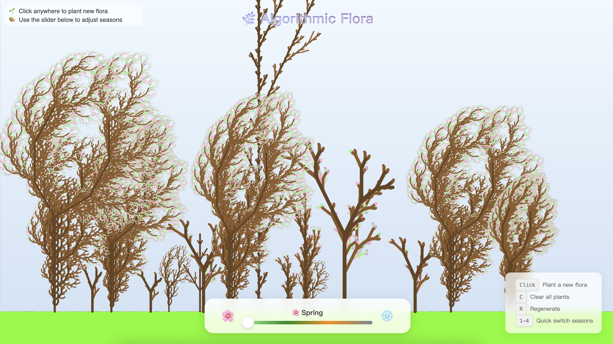
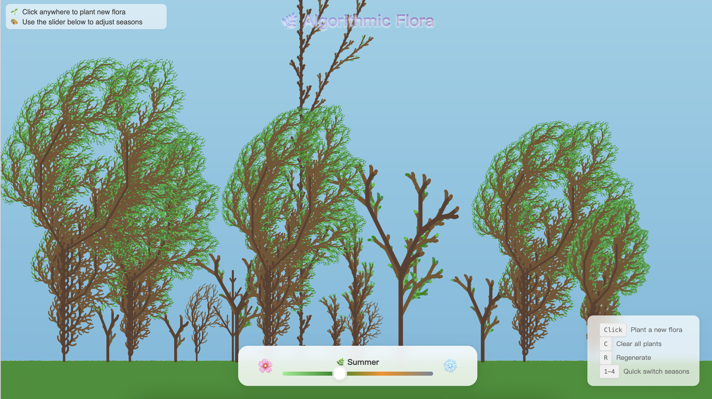
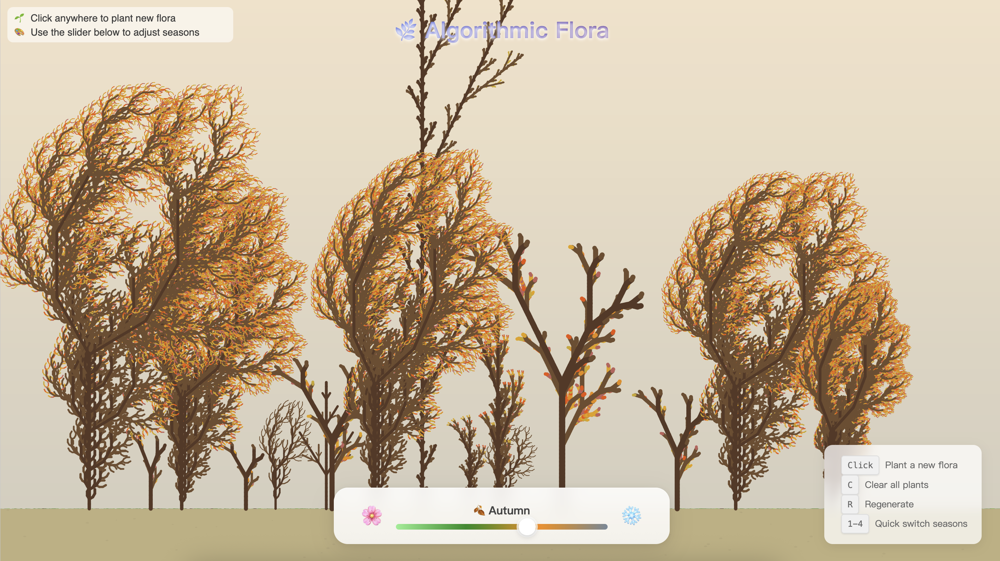
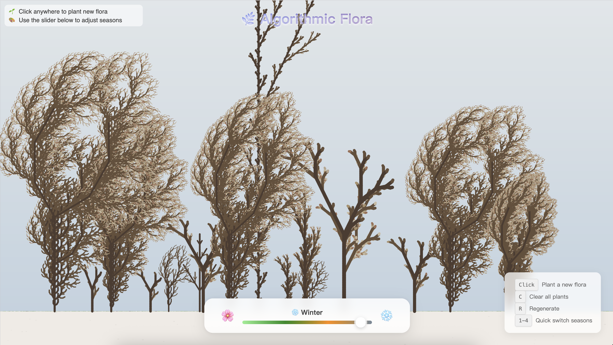

# Algorithmic Flora 🌿

**Live Demo: [https://addce.github.io/generative-art/](https://addce.github.io/generative-art/)**

An interactive digital forest created using **L-System (Lindenmayer System)** fractal algorithms and **p5.js**.

## Features

### 🎮 Interactive Experience
- **Seed-Based Planting**: Click anywhere on the ground to plant a new flora. Each click generates a unique seed based on the mouse position and current timestamp.
- **Real-time Growth Animation**: Watch your flora sprout and branch out with a smooth, progressive growth animation.
- **Dynamic Seasonal Control**: Use the slider or keyboard shortcuts (1-4) to seamlessly interpolate between four distinct seasons.
- **Canvas Management**: Easily clear your garden (Press `C`) or regenerate a fresh batch of initial plants (Press `R`).

### 🎨 Visual & Aesthetic Logic
- **Procedural Variety**: Powered by randomized L-System parameters, no two plants are exactly alike in structure or form.
- **Seasonal Color Interpolation**: Smooth transitioning of background, ground, trunk, and leaf colors using RGB linear interpolation.
- **Atmospheric Depth**: Gradient backgrounds and ground textures that adjust their mood and lighting based on the time of year.
- **Modern UI**: A clean, glassmorphism-inspired control panel that stays out of the way of your art.

### ⚙️ Technical Implementation
- **L-System Core**: A robust Lindenmayer System implementation capable of generating multiple plant archetypes (trees, bushes, ferns).
- **p5.js Integration**: High-performance canvas rendering and intuitive event handling.
- **Deterministic Randomness**: Seedable pseudo-random number generator ensures consistency within single plant instances while allowing for vast diversity across the forest.

## Seasonal Experiences

Explore the forest as it transforms through the cycle of the year:

| Spring 🌸 | Summer 🌿 |
| :---: | :---: |
|  |  |
| **Autumn 🍂** | **Winter ❄️** |
|  |  |

## Controls

- **Mouse Click**: Plant a new flora at the clicked position.
- **Season Slider**: Adjust the slider at the bottom to transition between seasons.
- **Keyboard Shortcuts**:
  - `C`: Clear all flora from the canvas.
  - `R`: Reset and regenerate a few initial plants.
  - `1 - 4`: Quick switch to Spring, Summer, Autumn, or Winter.

## Technologies Used

- **p5.js**: For creative coding and canvas rendering.
- **L-System**: A string-rewriting system used to model the growth processes of plants.
- **Vanilla JS/CSS**: For structure and styling.

## Project Structure

- `index.html`: Main interface and entry point.
- `css/style.css`: Modern glassmorphism UI styling.
- `js/lsystem.js`: Core L-System logic and ruleset definitions.
- `js/plant.js`: Flora object management, growth animation, and rendering.
- `js/seasons.js`: Seasonal color management and interpolation.
- `js/sketch.js`: p5.js main loop and event handling.

## Getting Started

Simply open `index.html` in any modern web browser to start exploring the digital forest.
